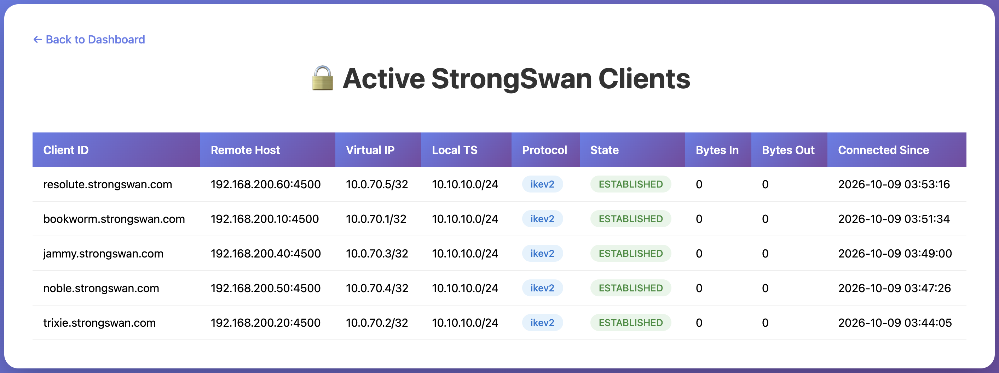

# StrongSwan Exporter

Prometheus exporter for StrongSwan IPsec server metrics with JSON session API endpoint.

## Example usage and testing

All CI tests of this exporter are done in the [strongswan-container repository](https://github.com/ThaseG/strongswan-container). Its pipeline builds the StrongSwan server image with this exporter, scans it with Trivy, deploys the server together with Debian Bookworm, Debian Bullseye and Ubuntu Jammy clients, runs ping tests through the established IPsec tunnels and validates the data returned by the exporter. Visit it to see an example usage of this exporter.

The CI in this repository only runs `golangci-lint` and a Trivy filesystem scan.

## Images

#### Main page
`http://<StrongSwan server IP>:9234`


#### Local clients
`http://<StrongSwan server IP>:9234/static`



#### Exporter Metrics
```
# http://<StrongSwan server IP>:9234/metrics

# HELP probe_success StrongSwan Status
# TYPE probe_success gauge
probe_success{version="6.1.0"} 1
# HELP strongswan_bytes_in_total Total number of bytes received
# TYPE strongswan_bytes_in_total counter
strongswan_bytes_in_total{client="bookworm.strongswan.com_10.0.70.1/32_ikev2"} 0
strongswan_bytes_in_total{client="jammy.strongswan.com_10.0.70.3/32_ikev2"} 0
strongswan_bytes_in_total{client="noble.strongswan.com_10.0.70.4/32_ikev2"} 0
strongswan_bytes_in_total{client="resolute.strongswan.com_10.0.70.5/32_ikev2"} 0
strongswan_bytes_in_total{client="trixie.strongswan.com_10.0.70.2/32_ikev2"} 0
# HELP strongswan_bytes_out_total Total number of bytes sent
# TYPE strongswan_bytes_out_total counter
strongswan_bytes_out_total{client="bookworm.strongswan.com_10.0.70.1/32_ikev2"} 0
strongswan_bytes_out_total{client="jammy.strongswan.com_10.0.70.3/32_ikev2"} 0
strongswan_bytes_out_total{client="noble.strongswan.com_10.0.70.4/32_ikev2"} 0
strongswan_bytes_out_total{client="resolute.strongswan.com_10.0.70.5/32_ikev2"} 0
strongswan_bytes_out_total{client="trixie.strongswan.com_10.0.70.2/32_ikev2"} 0
# HELP strongswan_info Software info
# TYPE strongswan_info counter
strongswan_info{product="charon",version="6.1.0"} 1
# HELP strongswan_sessions_total Total number of active sessions
# TYPE strongswan_sessions_total gauge
strongswan_sessions_total 5
```
#### Internal Exporter Metrics
```
# http://<StrongSwan server IP>:9234/prom

# HELP go_gc_duration_seconds A summary of the wall-time pause (stop-the-world) duration in garbage collection cycles.
# TYPE go_gc_duration_seconds summary
go_gc_duration_seconds{quantile="0"} 2.8523e-05
go_gc_duration_seconds{quantile="0.25"} 4.2526e-05
go_gc_duration_seconds{quantile="0.5"} 7.2968e-05
go_gc_duration_seconds{quantile="0.75"} 9.5038e-05
go_gc_duration_seconds{quantile="1"} 0.000439466
go_gc_duration_seconds_sum 0.016301329
go_gc_duration_seconds_count 216
# HELP go_gc_gogc_percent Heap size target percentage configured by the user, otherwise 100. This value is set by the GOGC environment variable, and the runtime/debug.SetGCPercent function. Sourced from /gc/gogc:percent
# TYPE go_gc_gogc_percent gauge
go_gc_gogc_percent 100
# HELP go_gc_gomemlimit_bytes Go runtime memory limit configured by the user, otherwise math.MaxInt64. This value is set by the GOMEMLIMIT environment variable, and the runtime/debug.SetMemoryLimit function. Sourced from /gc/gomemlimit:bytes
# TYPE go_gc_gomemlimit_bytes gauge
go_gc_gomemlimit_bytes 9.223372036854776e+18
# HELP go_goroutines Number of goroutines that currently exist.
# TYPE go_goroutines gauge
go_goroutines 8
# HELP go_info Information about the Go environment.
# TYPE go_info gauge
go_info{version="go1.25.14"} 1
# HELP go_memstats_alloc_bytes Number of bytes allocated in heap and currently in use. Equals to /memory/classes/heap/objects:bytes.
# TYPE go_memstats_alloc_bytes gauge
go_memstats_alloc_bytes 1.495616e+06
# HELP go_memstats_alloc_bytes_total Total number of bytes allocated in heap until now, even if released already. Equals to /gc/heap/allocs:bytes.
# TYPE go_memstats_alloc_bytes_total counter
go_memstats_alloc_bytes_total 1.29798816e+08
# HELP go_memstats_buck_hash_sys_bytes Number of bytes used by the profiling bucket hash table. Equals to /memory/classes/profiling/buckets:bytes.
# TYPE go_memstats_buck_hash_sys_bytes gauge
go_memstats_buck_hash_sys_bytes 1.444022e+06
# HELP go_memstats_frees_total Total number of heap objects frees. Equals to /gc/heap/frees:objects + /gc/heap/tiny/allocs:objects.
# TYPE go_memstats_frees_total counter
go_memstats_frees_total 2.383324e+06
# HELP go_memstats_gc_sys_bytes Number of bytes used for garbage collection system metadata. Equals to /memory/classes/metadata/other:bytes.
# TYPE go_memstats_gc_sys_bytes gauge
go_memstats_gc_sys_bytes 2.654992e+06
# HELP go_memstats_heap_alloc_bytes Number of heap bytes allocated and currently in use, same as go_memstats_alloc_bytes. Equals to /memory/classes/heap/objects:bytes.
# TYPE go_memstats_heap_alloc_bytes gauge
go_memstats_heap_alloc_bytes 1.495616e+06
# HELP go_memstats_heap_idle_bytes Number of heap bytes waiting to be used. Equals to /memory/classes/heap/released:bytes + /memory/classes/heap/free:bytes.
# TYPE go_memstats_heap_idle_bytes gauge
go_memstats_heap_idle_bytes 5.07904e+06
# HELP go_memstats_heap_inuse_bytes Number of heap bytes that are in use. Equals to /memory/classes/heap/objects:bytes + /memory/classes/heap/unused:bytes
# TYPE go_memstats_heap_inuse_bytes gauge
go_memstats_heap_inuse_bytes 2.752512e+06
# HELP go_memstats_heap_objects Number of currently allocated objects. Equals to /gc/heap/objects:objects.
# TYPE go_memstats_heap_objects gauge
go_memstats_heap_objects 5378
# HELP go_memstats_heap_released_bytes Number of heap bytes released to OS. Equals to /memory/classes/heap/released:bytes.
# TYPE go_memstats_heap_released_bytes gauge
go_memstats_heap_released_bytes 5.07904e+06
# HELP go_memstats_heap_sys_bytes Number of heap bytes obtained from system. Equals to /memory/classes/heap/objects:bytes + /memory/classes/heap/unused:bytes + /memory/classes/heap/released:bytes + /memory/classes/heap/free:bytes.
# TYPE go_memstats_heap_sys_bytes gauge
go_memstats_heap_sys_bytes 7.831552e+06
# HELP go_memstats_last_gc_time_seconds Number of seconds since 1970 of last garbage collection.
# TYPE go_memstats_last_gc_time_seconds gauge
go_memstats_last_gc_time_seconds 1.791519321989557e+09
# HELP go_memstats_mallocs_total Total number of heap objects allocated, both live and gc-ed. Semantically a counter version for go_memstats_heap_objects gauge. Equals to /gc/heap/allocs:objects + /gc/heap/tiny/allocs:objects.
# TYPE go_memstats_mallocs_total counter
go_memstats_mallocs_total 2.388702e+06
# HELP go_memstats_mcache_inuse_bytes Number of bytes in use by mcache structures. Equals to /memory/classes/metadata/mcache/inuse:bytes.
# TYPE go_memstats_mcache_inuse_bytes gauge
go_memstats_mcache_inuse_bytes 2416
# HELP go_memstats_mcache_sys_bytes Number of bytes used for mcache structures obtained from system. Equals to /memory/classes/metadata/mcache/inuse:bytes + /memory/classes/metadata/mcache/free:bytes.
# TYPE go_memstats_mcache_sys_bytes gauge
go_memstats_mcache_sys_bytes 15704
# HELP go_memstats_mspan_inuse_bytes Number of bytes in use by mspan structures. Equals to /memory/classes/metadata/mspan/inuse:bytes.
# TYPE go_memstats_mspan_inuse_bytes gauge
go_memstats_mspan_inuse_bytes 54080
# HELP go_memstats_mspan_sys_bytes Number of bytes used for mspan structures obtained from system. Equals to /memory/classes/metadata/mspan/inuse:bytes + /memory/classes/metadata/mspan/free:bytes.
# TYPE go_memstats_mspan_sys_bytes gauge
go_memstats_mspan_sys_bytes 97920
# HELP go_memstats_next_gc_bytes Number of heap bytes when next garbage collection will take place. Equals to /gc/heap/goal:bytes.
# TYPE go_memstats_next_gc_bytes gauge
go_memstats_next_gc_bytes 4.194304e+06
# HELP go_memstats_other_sys_bytes Number of bytes used for other system allocations. Equals to /memory/classes/other:bytes.
# TYPE go_memstats_other_sys_bytes gauge
go_memstats_other_sys_bytes 594282
# HELP go_memstats_stack_inuse_bytes Number of bytes obtained from system for stack allocator in non-CGO environments. Equals to /memory/classes/heap/stacks:bytes.
# TYPE go_memstats_stack_inuse_bytes gauge
go_memstats_stack_inuse_bytes 557056
# HELP go_memstats_stack_sys_bytes Number of bytes obtained from system for stack allocator. Equals to /memory/classes/heap/stacks:bytes + /memory/classes/os-stacks:bytes.
# TYPE go_memstats_stack_sys_bytes gauge
go_memstats_stack_sys_bytes 557056
# HELP go_memstats_sys_bytes Number of bytes obtained from system. Equals to /memory/classes/total:byte.
# TYPE go_memstats_sys_bytes gauge
go_memstats_sys_bytes 1.3195528e+07
# HELP go_sched_gomaxprocs_threads The current runtime.GOMAXPROCS setting, or the number of operating system threads that can execute user-level Go code simultaneously. Sourced from /sched/gomaxprocs:threads
# TYPE go_sched_gomaxprocs_threads gauge
go_sched_gomaxprocs_threads 2
# HELP go_threads Number of OS threads created.
# TYPE go_threads gauge
go_threads 5
# HELP process_cpu_seconds_total Total user and system CPU time spent in seconds.
# TYPE process_cpu_seconds_total counter
process_cpu_seconds_total 1.58
# HELP process_max_fds Maximum number of open file descriptors.
# TYPE process_max_fds gauge
process_max_fds 524287
# HELP process_network_receive_bytes_total Number of bytes received by the process over the network.
# TYPE process_network_receive_bytes_total counter
process_network_receive_bytes_total 25398
# HELP process_network_transmit_bytes_total Number of bytes sent by the process over the network.
# TYPE process_network_transmit_bytes_total counter
process_network_transmit_bytes_total 28992
# HELP process_open_fds Number of open file descriptors.
# TYPE process_open_fds gauge
process_open_fds 9
# HELP process_resident_memory_bytes Resident memory size in bytes.
# TYPE process_resident_memory_bytes gauge
process_resident_memory_bytes 1.1767808e+07
# HELP process_start_time_seconds Start time of the process since unix epoch in seconds.
# TYPE process_start_time_seconds gauge
process_start_time_seconds 1.79149107691e+09
# HELP process_virtual_memory_bytes Virtual memory size in bytes.
# TYPE process_virtual_memory_bytes gauge
process_virtual_memory_bytes 1.265205248e+09
# HELP process_virtual_memory_max_bytes Maximum amount of virtual memory available in bytes.
# TYPE process_virtual_memory_max_bytes gauge
process_virtual_memory_max_bytes 1.8446744073709552e+19
# HELP promhttp_metric_handler_requests_in_flight Current number of scrapes being served.
# TYPE promhttp_metric_handler_requests_in_flight gauge
promhttp_metric_handler_requests_in_flight 1
# HELP promhttp_metric_handler_requests_total Total number of scrapes by HTTP status code.
# TYPE promhttp_metric_handler_requests_total counter
promhttp_metric_handler_requests_total{code="200"} 1
promhttp_metric_handler_requests_total{code="500"} 0
promhttp_metric_handler_requests_total{code="503"} 0
```
#### Local Sessions
```
# http://<StrongSwan server IP>:9234/sessions_local

[{"server":"strongswan-server","protocol":"ikev2","p1uniqueid":"1","p2uniqueid":"1","state":"ESTABLISHED","remotehost":"78.99.236.15","remoteport":"4500","remoteid":"user@example.com","remotets":"10.0.0.2/32","localts":"0.0.0.0/0","established":"2025-11-03 20:40:03","bytesin":"3557","bytesout":"3868","packetsin":"31","packetsout":"29"}]
```

## Features

- **Prometheus Metrics**: Exposes StrongSwan IPsec session metrics in Prometheus format
- **JSON API**: Provides detailed session information via `/sessions_local` endpoint
- **VICI Protocol**: Collects data directly from StrongSwan's VICI socket
- **Background Refresh**: Metrics are collected every `refresh_interval` seconds and served from cache, so scrapes never block on charon
- **Separate Internal Metrics**: Go runtime and process metrics are exposed on `/prom`, keeping `/metrics` StrongSwan-only
- **Same Design as OpenVPN Exporter**: Metric names, labels, JSON fields and web pages follow [openvpn-exporter](https://github.com/ThaseG/openvpn-exporter)

## Metrics Exposed

### Prometheus Metrics (`/metrics`)

- `probe_success` - StrongSwan status (1 = up, 0 = down) with version label
- `strongswan_info` - Software information (product, version)
- `strongswan_sessions_total` - Total number of active IKE SAs (IPsec tunnels)
- `strongswan_bytes_in_total` - Bytes received per client
- `strongswan_bytes_out_total` - Bytes sent per client

The `client` label has the format `<identity>_<remote traffic selector>_<protocol>`
(e.g. `user@example.com_10.0.0.2/32_ikev2`), the same scheme as the OpenVPN exporter
(`<CN>_<virtual IP>_<protocol>`). The identity is the EAP identity, falling back to the
XAuth identity and then the IKE remote-id. Counters of Child SAs sharing a label
(e.g. briefly during a rekey) are summed.

### JSON API (`/sessions_local`)

Returns one entry per Child SA including:
- Server name (`server_name` from config)
- Protocol (`ikev1`/`ikev2`)
- IKE SA unique ID (`p1uniqueid`) and Child SA unique ID (`p2uniqueid`)
- Client remote IP and port
- Client identity (EAP / XAuth identity or remote-id)
- Traffic selectors (remote = virtual IP, local)
- Connection state
- Bytes/packets in/out
- Session established time

## Prerequisites

### StrongSwan Server Configuration

Your StrongSwan server must have the VICI plugin enabled. This is typically enabled by default in modern StrongSwan installations.

Verify VICI socket exists:
```bash
ls -la /var/run/charon.vici
```

Ensure the user running the exporter has access to the VICI socket:
```bash
# Add user to the appropriate group
sudo usermod -aG strongswan prometheus
# or
sudo chmod 660 /var/run/charon.vici
```

## Installation

### Build from Source

```bash
# Clone the repository
git clone <your-repo-url>
cd strongswan-exporter

# Download dependencies
go mod download

# Build
go build -o strongswan-exporter

# Optional: Build with version info
go build -ldflags "-X main.version=1.0.0 -X main.buildDate=$(date -u +%Y-%m-%d)" -o strongswan-exporter
```

## Configuration

Create an `exporter.yaml` file:

```yaml
# Path to StrongSwan VICI socket
vici_socket: "/var/run/charon.vici"

# Server name to display in sessions
server_name: strongswan-server

# How often to query charon and refresh metrics (seconds, default: 15)
refresh_interval: 15

# Enable debug logging (default: false)
debug: false
```

## Usage

### Basic Usage

```bash
./strongswan-exporter
```

### With Custom Configuration

```bash
./strongswan-exporter --config.file=/etc/strongswan-exporter/exporter.yaml
```

### Command-line Options

```
  --web.listen-address=":9234"
      Address to listen on for web interface and telemetry
  
  --web.telemetry-path="/metrics"
      Path under which to expose metrics
  
  --config.file="exporter.yaml"
      Path to configuration file
  
  --help, -h
      Show help
```

## Endpoints

- `/` - Landing page with links
- `/metrics` - Prometheus metrics endpoint (StrongSwan metrics only)
- `/prom` - Internal exporter metrics (Go runtime, process)
- `/static` - HTML view of active connections
- `/sessions_local` - JSON API with local session information
- `/sessions` - Alias of `/sessions_local`, kept for backward compatibility

## Prometheus Configuration

Add this to your `prometheus.yml`:

```yaml
scrape_configs:
  - job_name: 'strongswan'
    static_configs:
      - targets: ['localhost:9234']
```

## Example Outputs

### Prometheus Metrics

```
# HELP probe_success StrongSwan Status
# TYPE probe_success gauge
probe_success{version="6.0.4"} 1

# HELP strongswan_info Software info
# TYPE strongswan_info counter
strongswan_info{product="charon",version="6.0.4"} 1

# HELP strongswan_sessions_total Total number of active sessions
# TYPE strongswan_sessions_total gauge
strongswan_sessions_total 3

# HELP strongswan_bytes_in_total Total number of bytes received
# TYPE strongswan_bytes_in_total counter
strongswan_bytes_in_total{client="user1@domain.com_10.10.1.2/32_ikev2"} 1234567
strongswan_bytes_in_total{client="user2@domain.com_10.10.1.3/32_ikev2"} 9876543

# HELP strongswan_bytes_out_total Total number of bytes sent
# TYPE strongswan_bytes_out_total counter
strongswan_bytes_out_total{client="user1@domain.com_10.10.1.2/32_ikev2"} 7654321
strongswan_bytes_out_total{client="user2@domain.com_10.10.1.3/32_ikev2"} 3456789
```

### JSON Sessions API

```json
[
  {
    "server": "strongswan-server",
    "protocol": "ikev2",
    "p1uniqueid": "1",
    "p2uniqueid": "1",
    "state": "ESTABLISHED",
    "remotehost": "203.0.113.45",
    "remoteport": "4500",
    "remoteid": "user1@domain.com",
    "remotets": "10.10.1.2/32",
    "localts": "0.0.0.0/0",
    "established": "2024-01-15 10:30:45",
    "bytesin": "1234567",
    "bytesout": "7654321",
    "packetsin": "8901",
    "packetsout": "12345"
  },
  {
    "server": "strongswan-server",
    "protocol": "ikev2",
    "p1uniqueid": "2",
    "p2uniqueid": "2",
    "state": "ESTABLISHED",
    "remotehost": "203.0.113.89",
    "remoteport": "4500",
    "remoteid": "user2@domain.com",
    "remotets": "10.10.1.3/32",
    "localts": "0.0.0.0/0",
    "established": "2024-01-15 11:15:22",
    "bytesin": "9876543",
    "bytesout": "3456789",
    "packetsin": "15678",
    "packetsout": "23456"
  }
]
```

## Security Considerations

1. **Socket Permissions**: Ensure the VICI socket has appropriate permissions
2. **Firewall**: Restrict access to port 9234 to authorized hosts only
3. **Sensitive Data**: The `/sessions_local` and `/static` endpoints exposes client IPs and identities - consider authentication

## Troubleshooting

### No metrics shown

- Check that StrongSwan is running: `systemctl status strongswan`
- Verify VICI socket exists: `ls -la /var/run/charon.vici`
- Check socket permissions: ensure the exporter user can access the socket
- Review logs: `journalctl -u strongswan-exporter -f`

### Permission denied on VICI socket

```bash
# Add exporter user to strongswan group
sudo usermod -aG strongswan prometheus

# Or adjust socket permissions
sudo chmod 660 /var/run/charon.vici
sudo chown root:strongswan /var/run/charon.vici
```

### Connection to VICI fails

- Ensure the `vici` plugin is loaded in StrongSwan
- Check `/etc/strongswan.d/charon/vici.conf` exists
- Verify StrongSwan configuration allows VICI connections

### Empty session list despite active connections

- Verify connections are actually established: `swanctl --list-sas`
- Run with `debug: true` in `exporter.yaml` to log every collection cycle
- Review StrongSwan logs: `journalctl -u strongswan -f`

## License

This project maintains compatibility with the original exporter format.

## Contributing

Contributions are welcome! Please submit pull requests or open issues for bugs and feature requests.